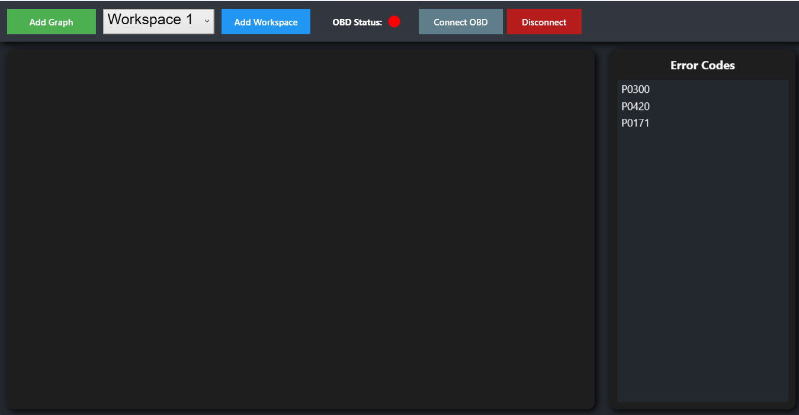
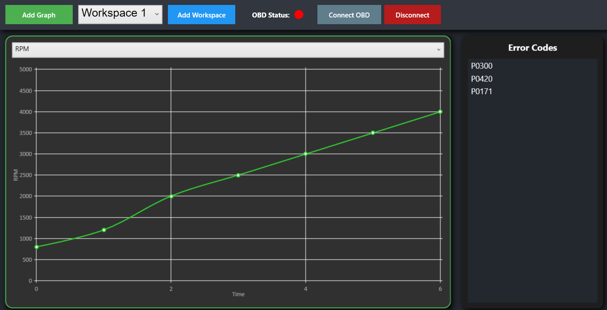
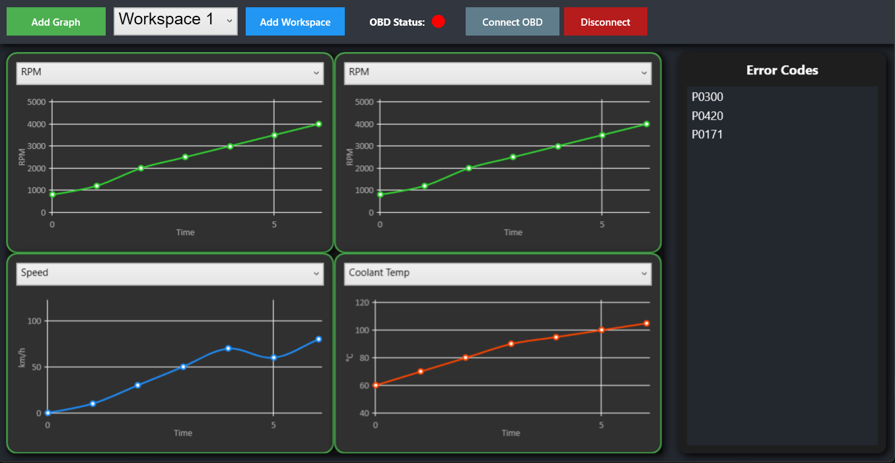

# PC-OBD-Reader

A modern Windows desktop app for reading and visualizing live OBD2 vehicle data via Bluetooth.

## Features

- **Bluetooth OBD2 Connection**: Connects to ELM327-compatible OBD2 adapters.
- **Live Data Graphs**: Visualize RPM, Speed, and Coolant Temperature in real time using LiveCharts.
- **Multiple Workspaces**: Organize different sets of graphs for various diagnostic scenarios.
- **Error Code Display**: View current OBD2 error codes in a dedicated panel.
- **Resizable, Movable Graphs**: Each graph can be resized and repositioned within the workspace.

## Screenshots





## Getting Started

### Prerequisites
- Windows 10/11
- .NET 8.0 SDK or newer
- Bluetooth-enabled PC
- ELM327-compatible Bluetooth OBD2 adapter

### Build & Run
1. **Clone the repository:**
   ```powershell
   git clone https://github.com/KamuiSW/PC-OBD-Reader
   cd PC-OBD-Reader
   ```
2. **Restore dependencies:**
   ```powershell
   dotnet restore
   ```
3. **Build the project:**
   ```powershell
   dotnet build
   ```
4. **Run the app:**
   ```powershell
   dotnet run --project PC-OBD-Reader/PC-OBD-Reader.csproj
   ```

## Usage

- **Connect to OBD2**: Click 'Connect OBD' in the toolbar. The app will scan for Bluetooth OBD2 adapters and connect.
- **Add Graphs**: Click 'Add Graph' to insert a new live data graph. Select the parameter (RPM, Speed, Coolant Temp) from the dropdown.
- **Workspaces**: Use the workspace selector to switch between different graph layouts. Add new workspaces as needed.
- **View Error Codes**: Error codes are displayed in the right panel.
- **Disconnect**: Click 'Disconnect' to end the Bluetooth session.

## Technology Stack
- **Language**: C#
- **Framework**: .NET 8.0, WPF
- **Bluetooth**: [32feet.NET](https://inthehand.github.io/32feet/)
- **Graphing**: [LiveCharts.Wpf](https://lvcharts.net/)

## License

This project is licensed under the MIT License. See [LICENSE](LICENSE) for details.

